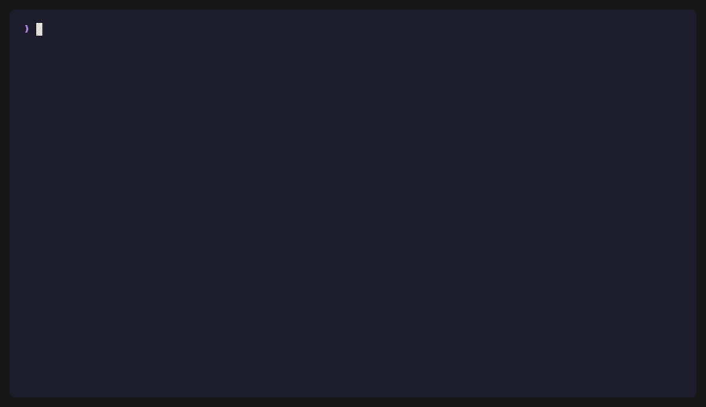
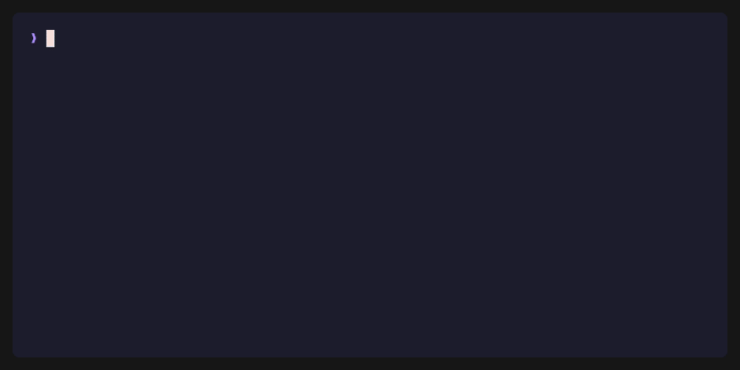
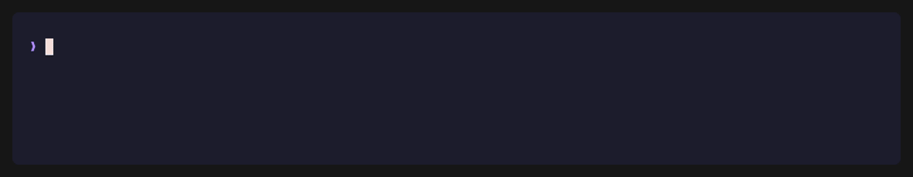

# cast

A beautiful terminal task runner. Reads your `Makefile`, surfaces every target
with keyboard shortcuts and live colorized output, treats long-running log
streams as first-class citizens — and now autocompletes your doc-lines with an
LLM and runs against any Makefile you point it at.

<p align="center">
  
</p>

> Demos are recorded with [VHS](https://github.com/charmbracelet/vhs). The
> `cast ai annotate` clip shows illustrative output (the real command calls an
> LLM); everything else is the real binary.

---

## Install

```bash
make build           # → bin/cast (per-platform binaries under bin/)
make install         # installs to $GOPATH/bin
```

Requires **Go 1.25+**. No runtime dependencies beyond a modern terminal.

---

## Quick start

```bash
cd my-project/
cast init dev        # writes .cast.toml (env: dev | staging | prod)
cast                 # launches the TUI
```

Discovery happens automatically — `cast` scans the `Makefile` in the current
directory (walking up to parent directories if needed) and surfaces every
target.

---

## TUI

### Layout

```
┌───────────────────┬────────────────────┬──────────────────────┐
│      SIDEBAR      │       CENTER       │        OUTPUT        │
│  search + command │  command detail /  │   live terminal +    │
│  list with badges │  env viewer /      │   recent-run list    │
│                   │  makefile section  │                      │
└───────────────────┴────────────────────┴──────────────────────┘
```

The three panels can be resized in real time and the center panel can be
hidden entirely via config — see [Layout](#layout-1).

### Tabs

| Tab | What it shows |
|---|---|
| **Commands** | Searchable list of Makefile targets with auto-color-coded tags. |
| **History**  | Chronological list of past runs (persisted in SQLite). Toggles between single-command and chain views with `ctrl+s`. |
| **Env**      | Viewer + editor for the project's `.env` file with sensitive-value masking. |
| **Theme**    | Theme preview + persist to `.cast.toml`. |
| **Library**  | Reusable Makefile snippets stored under `~/.config/cast/snippets/`. |

### Keybindings

**Global**

| Key | Action |
|---|---|
| `tab` / `shift+tab` | Next / previous tab |
| `up` / `down` | Move selection |
| `g` / `G` | Top / bottom |
| `/` | Focus search input |
| `enter` | Run selected command |
| `ctrl+r` | Re-run last command (or chain) |
| `q` · `ctrl+x` | Quit (`ctrl+x` also works while search is focused) |
| `ctrl+c` | Cancel running command · second press quits |
| `ctrl+e` | Expand output popup (press again for fullscreen) |
| `ctrl+o` | Expand the current command's Makefile section |
| `ctrl+i` | **AI-annotate** the Makefile (autocomplete doc-lines + tags) |
| `ctrl+k` | Edit the selected command's shortcut (next keypress binds it) |
| `ctrl+t` | Open the tag editor popup for the selected command |
| `ctrl+y` | Extract the selected target into the snippet library |
| `ctrl+d` | Delete the selected command from the Makefile (with confirm) |
| `ctrl+s` | Toggle single ↔ chain mode |
| `ctrl+a` | Open the chain builder (multi-select targets to run in order) |
| `pgup` / `pgdn` | Scroll the center Makefile preview up / down |
| `[` / `]` | Shrink / grow output panel |
| `{` / `}` | Shrink / grow sidebar |

**Commands tab — any single letter / digit matching a command's shortcut runs that command immediately.**
Shortcuts win over the single-letter bindings above (`g`, `G`, `s`, `q`) so if you assign `q` to a target, pressing `q` runs it instead of quitting.

**Inside popups** (expanded output / Makefile view): `↑`/`↓`/`j`/`k`, `pgup`/`pgdn`, `g`/`G`; in the output popup `y` copies the buffer to the clipboard via OSC52; `esc` (or `ctrl+e`/`ctrl+o`) closes.

**Env tab**: `h`/`l` switch focus between sidebar and history, `j`/`k` for vertical nav, `s` toggles sensitive-value masking, `ctrl+z` restores a selected history entry.

### Streaming commands (docker logs, tail -f, …)

cast detects long-running log streams automatically and renders them with a
`LIVE` badge, pulsing dot, and per-level colorization (INFO / WARN / ERROR /
DEBUG / TRACE / FATAL via [charm.land/log/v2](https://charm.land/log/v2)
styles).

**Auto-detected patterns** in any recipe line:
- `tail -f` / `tail --follow`
- `docker logs -f`, `docker compose logs -f`
- `kubectl logs … -f`
- `journalctl … -f`
- `watch …`

**Manual override** via tag in the `##` comment: `[stream]` forces streaming
mode, `[no-stream]` disables it even if a pattern matches.

```make
## tail-prod: follow prod logs [stream]
tail-prod:
	docker logs -f my-service
```

`ctrl+c` sends SIGINT to the whole process group (so `make` + children die
together) and records the run as `stopped` — displayed with an orange `⏹` in
history instead of red `●`.

---

## AI annotation

cast can ask an LLM to write the missing `## name: desc [tags=…]` doc-lines for
your targets — so an undocumented Makefile becomes a fully-labelled cast sidebar
in one step. Scope is intentionally narrow: **description + category tags only**.
Behavioural flags (`[stream]`, `[confirm]`, `[interactive]`, …) are never
inferred, so the runner's semantics can't change behind your back.

<p align="center"></p>

**From the CLI:**

```bash
export GROQ_API_KEY=gsk_...
cast ai annotate --dry-run        # preview the proposed diff, write nothing
cast ai annotate                  # asks "Apply N annotation(s)? [y/N]"
cast ai annotate --target build   # only the build target
cast ai annotate --all            # re-annotate, overwriting existing doc-lines
cast ai annotate --json           # machine-readable Plan for scripts
```

**From the TUI:** press `ctrl+i` on the Commands tab. A popup offers three
choices — **t** (this target), **a** (targets without a doc-line), **A** (all,
overwriting). A spinner shows while the model is queried, then the proposed diff
is rendered: `⏎` applies it and reparses the Makefile so the sidebar updates
without a restart, `esc` cancels.

Configured under `[ai]` (see below). The API key is read from the env var named
by `api_key_env` (default `GROQ_API_KEY`) and is **never** stored in TOML.

---

## Alternate Makefile

By default cast reads `Makefile`. Point it at any other file — `Makefile.personal`,
`Makefile.ci`, a monorepo path — and **everything** (sidebar, preview,
`ai annotate`, `tags`/`shortcut`, and command execution) operates on that file.

<p align="center"></p>

Three ways, layered `[source] path` (local) < `CAST_MAKEFILE` (env) < `-f`/`--file`
(flag), honoured by **every** subcommand:

```bash
cast -f Makefile.personal                  # launch the TUI on it
cast --file Makefile.personal ai annotate  # subcommands honour it too
CAST_MAKEFILE=Makefile.personal cast       # via environment
```

```toml
# .cast.toml — per project
[source]
path = "Makefile.personal"
```

Selection is always explicit (cast never auto-prefers an alternate file), and
execution pins the file with `make -f <file>` so cast runs exactly what it
parsed — which also sidesteps make's own `GNUmakefile` > `makefile` > `Makefile`
precedence when several live in one directory.

---

## Chains

Run several targets in sequence as one unit. Toggle **chain mode** with `ctrl+s`,
or build a chain on the fly with `ctrl+a` (multi-select with `space`, `⏎`
dispatches in selection order). A failing step drops the rest (fail-fast); the
chain is persisted in SQLite on completion, deduped by a sha1 fingerprint and
capped by `[history].chain_max`.

---

## CLI

```
cast                           launch the TUI
cast init [dev|staging|prod]   write .cast.toml template in cwd
cast config                    show resolved config values + file paths

cast ai annotate [flags]       autocomplete Makefile doc-lines via an LLM
                               flags: --target X · --all · --dry-run · --yes · --json

cast env                       open TUI on the .env tab
cast env set KEY=VALUE         set a variable (persisted to .env + db)
cast env get KEY               print a variable's value
cast env list [-reveal]        list all variables (optionally unmasked)

cast shortcut list             show assigned shortcuts for all commands
cast shortcut set CMD K        assign single-char shortcut K to command CMD
cast shortcut unset CMD        remove shortcut for CMD (falls back to auto)

cast tags list                 show category tags for all commands
cast tags set CMD a,b          write [tags=a,b] on CMD's Makefile doc line
cast tags unset CMD            remove [tags=...] from CMD's doc line
```

**Flags**:
- `-env local|staging|prod` · `-theme catppuccin|dracula|nord`
- `-f`, `--file <path>` — run against an alternate Makefile (works in any
  position, honoured by every subcommand: `cast -f X ai annotate` and
  `cast ai annotate -f X` are equivalent).

---

## Configuration

cast reads configuration in **five layers**, later ones overriding earlier:

1. **Hardcoded defaults** (`config.Default()`).
2. **Global**: `~/.config/cast/cast.toml` — created automatically on first run.
3. **Local**: `.cast.toml` in the current working directory — optional, per-project overrides.
4. `CAST_ENV` environment variable (env name) and `CAST_MAKEFILE` (source path).
5. CLI flags `-env` / `-theme` / `-f`.

Run `cast config` any time to see the resolved values and which files were loaded.

### Global — `~/.config/cast/cast.toml`

```toml
[theme]
default = "catppuccin"   # catppuccin | dracula | nord

# Per-environment theme base. The accent color is always overridden:
#   staging → orange, prod → red.
[theme.env]
dev     = "catppuccin"
staging = "catppuccin"
prod    = "catppuccin"

[history]
max       = 100          # max run-history rows kept in SQLite
chain_max = 100          # max chain-execution rows kept in SQLite

[db]
path = ""                # empty = ~/.config/cast/cast.db

[source]
lookup_depth = 5         # parent dirs to walk when locating the Makefile (0 = cwd only)

[ai]                     # cast ai annotate backend
provider     = "groq"
model        = "llama-3.3-70b-versatile"
api_key_env  = "GROQ_API_KEY"   # env var holding the key — never stored here
endpoint     = "https://api.groq.com/openai/v1/chat/completions"
max_targets  = 40
timeout_secs = 30

[ai.tags]
allowed = ["build", "test", "deploy", "lint", "db", "docker", "dev", "clean", "release", "docs", "ci"]

[layout]
sidebar_width_pct  = 25  # 15–40 with center on, 30–50 with center off
output_width_pct   = 30  # 30–60 with center on, 30–50 with center off
show_center_panel  = true
```

### Local — `.cast.toml` (per project, commit to your repo)

```toml
[env]
name = "dev"             # dev | staging | prod — drives accent color
file = ".env"            # path to this project's .env file

[source]                 # (optional) run cast against an alternate Makefile
path = "Makefile.personal"

[layout]                 # (optional) overrides the global layout
sidebar_width_pct  = 20
output_width_pct   = 35
show_center_panel  = true

[commands.confirm]       # targets that always show the confirmation modal
targets = ["deploy", "db-migrate-prod"]

[commands.shortcuts]     # command-name → single-char keyboard shortcut
build = "b"
test  = "t"
deploy = "d"
```

### Layout

Three panels, each a percentage of the terminal width. Validated at startup —
an invalid combination refuses to launch with a concrete error.

| `show_center_panel` | Sidebar range | Output range | Sum cap |
|---|---|---|---|
| `true`  | 15 – 40 % | 30 – 60 % | ≤ 90 % (leaves ≥ 10 % for center) |
| `false` | 30 – 50 % | 30 – 50 % | ≤ 100 % (sidebar + output fill the screen) |

Runtime adjustment (doesn't persist):
- `[` / `]` — shrink / grow output panel (±5 %)
- `{` / `}` — shrink / grow sidebar (±5 %)

Both respect the current maximum derived from the sibling panel's size and the
`show_center_panel` flag.

### Themes and environments

| Theme | Accent |
|---|---|
| `catppuccin` (default) | mauve |
| `dracula` | purple |
| `nord` | frost blue |

**Environments override the accent color**:

| Env | Accent |
|---|---|
| `local` | theme default |
| `staging` | orange |
| `prod` | red |

---

## Makefile integration

cast parses every `## name: description` comment above a target, plus bare
targets without docs.

```make
## build: Compile the binary
build:
	go build -o bin/cast ./cmd/cast
```

### Supported inline tags

Tags live at the end of the description and stack in any order.

| Tag | Effect |
|---|---|
| `[stream]` | Mark as long-running log stream (LIVE badge, ctrl+c cancels). |
| `[no-stream]` | Disable auto-detection even if the recipe matches a follow pattern. |
| `[confirm]` | Always show the confirmation modal before running, in any env. |
| `[no-confirm]` | Never show the confirmation modal — even in `staging` / `prod`. |
| `[interactive]` / `[no-interactive]` | Attach a real TTY (psql, python3, vim…) or force non-interactive. |
| `[sc=X]` or `[shortcut=X]` | Assign keyboard shortcut `X` (single char). |
| `[sc=]` | Disable shortcut entirely (renders with `⬢` icon). |
| `[tags=a,b,c]` | Category tags shown as colored chips in the sidebar and center header. |
| `[pick=SPEC]` / `[as=A,B,…]` | Folder/file picker prompt feeding the recipe (`$(CAST_PICK_N)`). |

```make
## deploy-prod: Deploy to production [confirm] [sc=D]
deploy-prod:
	./scripts/deploy.sh prod

## live-logs: Follow service logs [stream] [no-confirm] [sc=L]
live-logs:
	docker logs -f my-service
```

### Confirmation modal

cast shows a confirmation prompt before running a command when any of the
following is true (checked top to bottom — first match wins):

1. The command has `[no-confirm]` → **never** prompts, even in prod.
2. The command has `[confirm]` → **always** prompts, in any env.
3. The active env is `staging` or `prod` → prompts by default.
4. Otherwise → runs immediately.

Use `[no-confirm]` for log-streaming targets and other read-only commands
you run dozens of times a day in prod. Use `[confirm]` for destructive
dev-env commands (`db-reset`, `wipe-cache`, etc.) where the env check alone
wouldn't catch a mistake.

### Editing the Makefile from the TUI

cast can edit the `##` doc line in place — every write preserves unrelated tags:

- `ctrl+i` — AI-annotate missing doc-lines + tags (see [AI annotation](#ai-annotation)).
- `ctrl+k` — enter shortcut-edit mode; the next keypress becomes the command's
  `[sc=X]` tag (`backspace` clears it, `esc` cancels).
- `ctrl+t` — open a popup with checkbox toggles for `[stream]`, `[no-stream]`,
  `[confirm]`, `[no-confirm]`, plus the current `[tags=...]` and `[sc=X]`.
  Navigate with `↑`/`↓` (also `j`/`k`), toggle with `space`/`⏎`, `t` enters the
  tags editor (comma-separated; `⏎` saves, `esc` cancels), `ctrl+k` jumps to the
  shortcut editor. Mutually-exclusive tags (stream ↔ no-stream, confirm ↔
  no-confirm) are kept consistent automatically.
- `ctrl+y` — extract the selected target into the snippet library.
- `ctrl+d` — delete the selected target from the Makefile (with confirm).

### Auto-inference

When no `[sc=…]` tag is present, cast picks the **first unused letter** of the
command name as the shortcut (skipping letters reserved by global hotkeys).
Category tags are **not** inferred — use `[tags=a,b,c]` in the Makefile (or
`cast tags set CMD a,b`) to attach them explicitly. Commands with no tags simply
render without chips.

### Shortcut resolution order

From lowest to highest priority:

1. **Auto-inferred** (first free letter of the name).
2. **Makefile tag** `[sc=X]` in the `##` comment.
3. **Config override** in `.cast.toml` under `[commands.shortcuts]`.

Commands without any assigned shortcut render a muted **`⬢`** icon in the
sidebar instead of a letter — still runnable via arrows + `enter`, just not
with a single keystroke.

Manage shortcuts from the CLI:

```bash
cast shortcut list             # → KEY / COMMAND / ORIGIN (makefile | .cast.toml)
cast shortcut set deploy d     # persists to [commands.shortcuts] in .cast.toml
cast shortcut unset deploy     # removes the override; falls back to tag/auto
```

The `set`/`unset` commands edit `.cast.toml` surgically — comments and
unrelated sections are preserved.

---

## Snippet library

Reusable Makefile targets live under `~/.config/cast/snippets/<name>.mk` (plain
Make, so your editor highlights them). Browse them in the **Library** tab with a
side-by-side preview: `enter` inserts the snippet into the current Makefile,
`dd` deletes it, and `ctrl+y` (from the Commands tab) extracts the highlighted
target into the library.

---

## History

Every run is persisted in a SQLite database (default
`~/.config/cast/cast.db`). Status is one of:

| Status | Icon | Meaning |
|---|---|---|
| `success` | green `●` | exit 0 |
| `error` | red `●` | non-zero exit |
| `stopped` | orange `⏹` | user-interrupted via ctrl+c |
| `running` | yellow `●` | in-flight (transient) |

Run `cast config` to see the current DB path and use `[history].max` /
`[history].chain_max` in the global config to cap retained rows.

---

## Build, test, lint

```bash
make build    # binary in bin/
make run      # build + run
make test     # go test ./...
make lint     # golangci-lint
```

---

## Demo GIFs

The README GIFs are generated with [VHS](https://github.com/charmbracelet/vhs).
The tapes and a regeneration guide live under [`demo/`](demo/) — run
`vhs demo/tapes/<name>.tape` from the repo root to refresh one.

---

## Project layout

Codebase reference lives in [`CLAUDE.md`](CLAUDE.md) (directory tree, import
graph, TUI data flow). Deep-dive topics are split into [`docs/ai/`](docs/ai/):

- [`lipgloss-pitfalls.md`](docs/ai/lipgloss-pitfalls.md) — rendering gotchas.
- [`debugging-views.md`](docs/ai/debugging-views.md) — the throwaway
  `cmd/debugview` technique for reproducing layout bugs.
